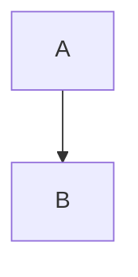

# Код

```js title="x.js"
const a = 1;  // два пробела
	if (a) {
		return;
	}
```

~~~
тильды
~~~

    indented code
      keeps spaces


```mermaid
graph TD; A-->B;
```

Inline `code  with  spaces` and ``double `tick` code``.
